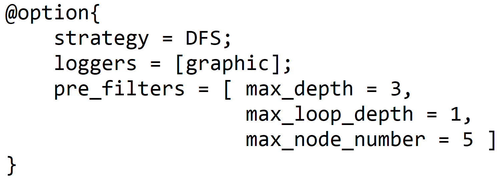
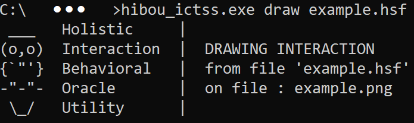
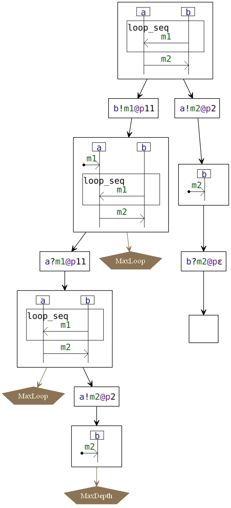

# HIBOU ICTSS 2020

This piece of software has been developped as part of a PhD thesis in 2018-2020.
This particular build has been prepared to accompany the publication of a paper in the 2020 edition of the ICTSS
conference (32ND IFIP INTERNATIONAL CONFERENCE ON TESTING SOFTWARE AND SYSTEMS).

This README describes the software implementation.

If you are interested in the Coq proof, please click on this 
[link](https://erwanm974.github.io/coq_ictss_2020/)

HIBOU (for Holistic Interaction Behavioral Oracle Utility) provides utilities for the analysis of traces and 
multi-traces collected from the execution of Distributed Systems against interaction models.

## Entry language

Interaction models are specified with .hsf (Hibou Specification File) files.
The figure below illustrates:
- on the left the model of the interaction as a binary tree (mathematical model)
- in the middle the encoding using the entry langage of HIBOU (PEG grammar)
- on the right the resulting sequence diagram as drawn by HIBOU  

### Signature Declaration

The signature of the interaction model is declared in the "@message" and "@lifeline" sections of the .hsf file.
It suffices then to list the different message names and lifeline names that will be used in the model.

### Interaction Term

The interaction term is specified using a simple and intuitive inductive language.
- a reception "a?m" is specified using "m -> a"
- an emission to the environment "a!m" is specified using "a -- m ->|"
- message passings are encoded using "a -- m -> b"
- broadcasts are encoded using "a -- m -> (b,c,...)"
- loop operators (loop_strict, loop_seq, loop_par) are unary
- every other operator (strict,seq,alt,par) have been extended to allow n-ary expressions

### Process options

Additionally, one can specify in the header of a .hsf file 
a number of options that will then be used if this .hsf file is exploited 
in some algorithmic process
("explore" or "analyze" command).

In the example below, a Depth First Search exploration strategy 
is specified (by default it is Breadth First Search).

We can specify that we want algorithmic treatments of this .hsf file to be logged with the "loggers" attribute.
In this build only a "graphic" logger exists. 
It will create an image file (a .png file with the same name as the .hsf file) describing the treatment.

Finally, we can specify a number of filters that will limit the exploration 
of graphs in algoritmic treatments  in 
different ways.
- "max_depth" limits the depth of the explored graph
- "max_loop_depth" limits the cumulative number of loop instances that can be unfolded in a given execution
- "max_node_number" limits the number of nodes in the explored graph

## Draw

Diagrams, such as the one on the previous image can be drawn using the "hibou draw" command as exemplified below.

## Explore

HIBOU can generate execution trees which illustrate the semantics of the a given interaction model.
The exploration of such execution trees can be defined up to certain limits (depth, number of nodes, loop 
instanciations) and up to certain search algorithms.

Below is given an example exploration:

And a second example:

## Analyze

HIBOU can analyse traces or multitraces (defined with any groups of co-localized lifelines).
A given analysis opens-up paths in the execution tree that are compliant with the consumption 
of the given multitrace. 

(Multi)traces to be anlyzed are provided in .htf (Hibou Trace File) files. 
On the example below a multitrace composed of 2 canals is defined.
- on the co-localization of the 2 lifelines "a" and "b", the local trace "b!m.a!m" has been logged
- on the localization of the "c" lifeline, the local trace "c?m.c?m" has been logged

The analysis of this multitrace against a given interaction model then generates a "Pass" verdict and the following 
image describes the process.

If, in any one of those paths the exploration terminates on a node
where the multitrace has been emptied and the interaction can express the empty trace
then the analysis is successful and the global verdict "Pass" is returned on the command line interface.

If, this previous case does not occur in any explored path, 
the global verdict "Fail" is returned on the command line interface.

## Build

You can build the Rust project with cargo using "cargo build --release".

This will generate an executable in "./target/release".

Or you could download the provided binary for windows.

## Requirements / Dependencies

So as to generate the images of the graphs, you will need to have graphviz installed on your system
and the "dot" command must be in your "PATH" environment variable.

## Examples

All the examples in this README are provided in the "examples" directory as well as the commands used to generate the images above.
