# HIBOU LABEL

HIBOU (for Holistic Interaction Behavioral Oracle Utility) provides utilities for the analysis of traces and 
multi-traces collected from the execution of Distributed Systems against interaction models.

This present version "hibou_label" treats labelled interaction models.
An extension "[hibou_efm](https://github.com/erwanM974/hibou_efm)" that treats interaction
models enriched with data and time is also available.

This piece of software has been developed as part of my PhD thesis in 2018-2020 at the 
[CentraleSupelec](https://www.centralesupelec.fr/)
engineering school
(part of Université Paris-Saclay) 
in collaboration with the 
[CEA](http://www.cea.fr/) (Commissariat à l'énergie atomique et aux énergies alternatives).

We described our approach in the following paper: 
"[Revisiting Semantics of Interactions for Trace Validity Analysis](https://link.springer.com/chapter/10.1007%2F978-3-030-45234-6_24)"
which was published in the 
23rd International Conference on Fundamental Approaches to Software Engineering
(FASE-2020), which is part of ETAPS (European joint conferences on Theory And Practice of Software).

The theoretical background of this version of HIBOU is described in [this paper](https://arxiv.org/abs/2009.01777)
(currently available on Arxiv).
If you are interested in the Coq proof associated with [this paper](https://arxiv.org/abs/2009.01777), please click on this 
[link](https://erwanm974.github.io/coq_hibou_label_multi_trace_analysis/) or visit the following
[repository](https://github.com/erwanM974/coq_hibou_label_multi_trace_analysis).

# Entry language : Interactions (.hsf files)

Interaction models are specified with ".hsf" (Hibou Specification File) files.
The figure below illustrates:
- on the left the model of the interaction as a binary tree (mathematical model)
- in the middle the encoding using the entry langage of HIBOU (PEG grammar)
- on the right the resulting sequence diagram as drawn by HIBOU  


## Signature Declaration

The signature of the interaction model is declared in the "@message" and "@lifeline" sections of the ".hsf" file.
It suffices then to list the different message names and lifeline names that will be used in the model.

For instance, in the example above 
(which you can find as "example_for_analysis.hsf" in the "examples" folder),
we have the following:

```
@message{
    m1;
    m2;
    m3;
    m4
}
@lifeline{
    a;
    b;
    c
}
```

## Interaction Term

Interactions are terms of a formal language, that can be specified using a simple and intuitive inductive language.
Those terms are build inductively from the composition of basic buildings blocks using specific operators.

### Basic building blocks

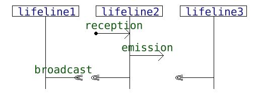

The most basic interactions can either be:
- the empty interaction, that specify an absence of observable behavior and which is encoded with "o" or "∅"
- the reception of a message "m" on a lifeline "a" from the environment, which is encoded with "m -> a"
- the emission of a message "m" from lifeline "a" to the environment, which is encoded using "a -- m ->|"
- the passing of a message "m" from lifeline "a" to lifeline "b", which is encoded with "a -- m -> b" (here message "m" is passed asynchronously from lifeline "a" to "b")
- an asynchronous broadcast, which can be encoded with "a -- m -> (b,c,...)"

### Operators

Interaction terms can be composed inductively using some operators so as to build more complex interaction terms.
We define the following operators:
- "strict", "seq" and "par", which are the classical "scheduling operators" and "coreg", which is another special "scheduling operator"
- "alt" which is the "alternative operator"
- "loop_strict", "loop_seq" and "loop_par" which are "repetition operators"

#### Scheduling operators
Scheduling operators specify how the execution of different sub-interactions can be scheduled w.r.t. one another.
Given sub-interactions "i1", "i2", ..., and "in", and given a scheduling operator "f",
we encode using "f(i1,i2,...,in)" the interaction which results from the scheduling with "f" of those sub-interactions.
We allow n-ary expressions in the entry language but the interaction term is constructed as a binary tree in hibou.

- the "strict" operator specifies strict sequencing i.e. preceding sub-interactions must be executed entirely before any following interaction can be
- the "seq" operator specifies weak sequencing i.e. a strict scheduling is only enforced between actions occurring on the same lifeline 
- the "par" operator allow any interleaving of the executions of sub-interactions
- "coreg(PL)" operators can be configured by a subset PL of lifelines which behaviors are to be parallelized.
"coreg(PL)" then behaves as "seq" for lifelines not in PL, and as "par" for lifelines which belong to PL

#### Alternative operator

The "alt" operator specified exclusive alternative choice between the execution of sub-interactions. As for the scheduling operators, we allow n-ary expressions.

#### Repetition operators 

Loop operators are unary operators that represent the repetition of a given sub-interaction,
each repeated behavior being sequenced w.r.t. the others using one of the 3 scheduling operators.

For instance "loop_seq(m->a)" is equivalent to the infinite alternative "alt(∅,m->a,seq(m->a,m->a),...)".

### Example

From the previously defined building blocks and operators we can define interaction terms 
such as the one below, which is the example from the introduction:

```
seq(
    loop_seq(
        seq(
            a -- m1 -> b,
            alt(
                b -- m2 -> c,
                o
            ),
            b -- m3 ->|
        )
    ),
    par(
        a -- m1 ->|,
        c -- m4 -> a
    )
)
```

### Another example, with the full .hsf specification

Below is given another example, showcasing a (trinary) co-region.

```
@message{
    m1;m2;m3;m4;m5;m6;m7
}
@lifeline{
    l1;l2;l3
}
seq(
    coreg(l2)(
        l1 -- m1 -> l2,
        l1 -- m2 -> l2,
        l1 -- m3 -> l2
    ),
    loop_seq(    
        alt(
            l2 -- m4 -> l1,
            seq(
                l2 -- m5 -> l3,
                l3 -- m6 -> (l1,l2)
            )
        )
    ),
    l2 -- m7 -> l1
)
```

And the corresponding graphical representation (as a sequence diagram):

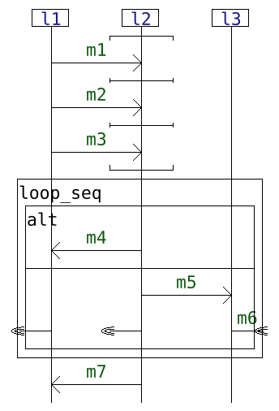

## Process options

Additionally, one can specify in the header of a ".hsf" file 
a number of options that will then be used if this ".hsf" file is exploited 
in some algorithmic process.

The "@analyze_option" section specifies options to be used when the model is exploited 
as a reference for the analysis of a multi-trace with the "analyze" command.
                       
The "@explore_option" section specifies options to be used when the model is exploited 
for the exploration of its possible executions with the "explore" command.

We will detail the available options when describing the "analyze" and "explore" commands.

# Entry language : traces & multi-traces (.htf files)

When a distributed system is executed, we can collect logs on the external interfaces of its sub-system so as to have a
trace of the events that were observed during the execution. We consider two kinds of events that may occur on the interface
of sub-systems: emissions and receptions of messages.

As the lifelines of an interaction model represent the sub-systems of the distributed system modelled by the interaction,
we can understand those collected logs - called traces - as sequences of words 
"l!m" or "l?m" - called actions - where "l" is a lifeline and "m" a message.
An action "l!m" corresponds to the emission of message "m" from lifeline "l"
(disregarding the target of said emission).
An action "l?m" corresponds to the reception of message "m" on lifeline "l"
(disregarding the source of the message).

## Centralized traces
A centralized trace is a sequence of any such action regardless of the lifelines on which they occur. 
Below is given, in the syntax accepted by HIBOU, such a centralized trace. 
This trace must be specified in a ".htf" file, which stands for Hibou Trace File.
Here, the "[#all]" signifies that the trace is defined over all lifelines.

```
[#all] a!m1.b?m1.b!m2.c?m2
```

In [this paper](https://link.springer.com/chapter/10.1007%2F978-3-030-45234-6_24), we describe our approach for the analysis of centralized traces.

## Multi-traces

However, it is not always possible to collect such centralized traces. 
More often that not, we have a local log/trace for each sub-system of the distributed system.
As such, we use the notion of multi-trace.

Multi-traces are sets of traces called its components. 
Each component is defined over a subset of lifelines called a co-localization that is disjoint to that of any other component.

In [this other paper](https://arxiv.org/abs/2009.01777), we describe our approach for the analysis of multi-traces.
In it, we restricted co-localizations to singletons in order to simplify the presentation.
However, our approach still works when considering the more general case of co-localizations.

On the example below is given an example of ".htf" file which defines a multi-trace composed of 2 components:
- on the co-localization of the 2 lifelines "a" and "b", the local trace "b!m.a!m" has been logged
- on the localization of the "c" lifeline, the local trace "c?m.c?m" has been logged

```
{
    [a,b] b!m.a!m;
    [c]   c?m.c?m
}
```

Let us note that we can also analyze global traces simply by defining a multi-trace with a single component as is done below.
Here we used the "#all" keyword to state that this component is defined over all the lifelines defined in "@lifeline".

```
{
    [#all] a!m1.b?m1.b!m2.c?m2
}
```

We can also use the "#any" keyword to state that a given multi-trace component is defined over all the lifelines that appear in the subsequent trace definition.
For example below is defined a multi-trace that is the same than the one in our previous multi-trace example.
The first component is defined over lifelines "a" and "b", and the second over lifeline "c".

```
{
    [#any] b!m.a!m;
    [#any] c?m.c?m
}
```

## Lifelines with no specified trace component

Using a ".htf" file is done with regards to a ".hsf" file which defines the model against which the multi-trace will be analyzed.
In the illustration below, the multi-trace on the right "(a!m.a!m, ε)" is to be analyzed against the interaction "loop_seq(a -- m -> b)".

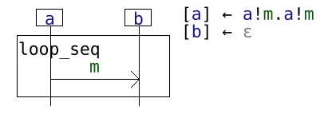

If, in a given ".htf" file, traces on some lifelines are not specified, the corresponding lifelines are automatically fitted with the empty trace.
As such, w.r.t. the interaction on the left in the illustration above, we can specify the multi-trace "(a!m.a!m, ε)" in a ".htf" file either with:

```
{
    [a] a!m.a!m;
    [b] 
}
```

Or simply with (for instance):

```
[#any] a!m.a!m
```
 
Here lifeline "b" has no specified canal. As such, it will be automatically fitted with a dedicated canal containing the empty trace "ε". 

# Command Line Interface

The functionnalities of HIBOU are accessed via a Command Line Interface (CLI).
For the version presented in this repository, you will have to launch the executable "hibou_label" (or "hibou_label.exe" on Windows OSs) from a terminal.

## Help

The HIBOU executable provides a small documentation about its interface. This can be accessed by typing "hibou_label help" or "hibou_label -h".
It explaines that there are 4 sub-commands in HIBOU:
- "draw" (to be used as "hibou_label draw <.hsf file>"), which draws as a sequence diagram a given interaction
- "analyze" (to be used as "hibou_label analyze <.hsf file> <.htf file>"), which analyze a multi-trace w.r.t. an interaction
- "explore" (to be used as "hibou_label explore <.hsf file>"), which computes (partially or totally if possible) the semantics of a given interaction
- "help", which is the present help

Each sub-command also has its dedicated documentation:
- "hibou_label draw -h" provides a small documentation for the drawing utility
- "hibou_label analyze -h" provides a small documentation for the "analyze" sub-command
- "hibou_label explore -h" provides a small documentation for the "explore" sub-command

In the following, we provide more details about those sub-commands.

## Draw

Diagrams, such as the one on the previous images can be drawn using the "hibou draw" command as exemplified below.

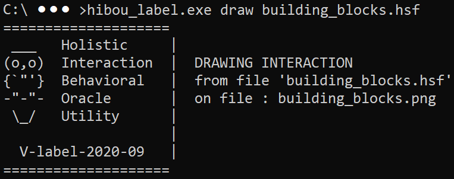


## Analyze - Introduction

The "analyze" sub-command of HIBOU can analyse multi-traces w.r.t. interactions. 
For any multi-trace and any interaction, it returns a verdict about the conformity of the multi-trace w.r.t.
a certain semantics of the interaction.

Indeed, one can consider several semantics (sets of multi-traces specified by a given interaction) when dealing with interaction languages.
In our approach, we distinguish between:
- "AccMult", the semantics which is that of exactly accepted multi-traces (projections of accepted global traces)
- "SemMult", the semantics which is that of multi-traces which are obtained from projecting prefixes of accepted global traces
- "MultiPref", that of prefixes (in the sense of multi-traces) of multi-traces from "AccMult" (i.e. one can remove actions at the end of each 
local component of the multi-trace independently)
- "Slices", that of slices of multi-traces from "AccMult" (i.e. one can remove actions at both the end and the beginning
of each local component of the multi-trace independently)

You may have guessed that for any given interaction, its associated semantics (using those 4 semantics) form a set of
russian matryoshka dolls i.e. they are included in one another as follows:
AccMult is in SemMult which is in MultiPref, itself in Slices.

In hibou_label, we propose several distinct methods (abusively called "semantics") to identify if a given multi-trace is in 
any one of those sets w.r.t. a given interaction.
The method used is specified using the "semantics" attribute ("prefix" is the default) in the "@analysis_option" 
section of the input ".hsf" file.

The proposed methods are:
- ``semantics=accept``, which returns a verdict "Pass" if the multi-trace is in "AccMult" or "Fail" if not
- ``semantics=prefix``, which returns "Pass" if the multi-trace is in "AccMult", "WeakPass" if it is in "SemMult" but not in "AccMult", 
and either "Inconc" or "Fail" if not, as explained in Sec.4.5 of [this paper](https://arxiv.org/abs/2009.01777)
- ``semantics=hide``, which returns "Pass" if the multi-trace is in "AccMult", "WeakPass" if it is in "SemMult" but not in "AccMult", 
either "WeakPass" or "Inconc" if it is in "MultiPref" but not in "SemMult" (WeakPass if all local components of the
multi-trace are defined on a single lifeline i.e. co-localizations are singletons), and "Fail" if none of the above. This method uses
a specific "hide" function that we will detail in an upcoming paper.
- ``semantics=simulate[multi-prefix]``, which returns "Pass" if the multi-trace is in "AccMult", "WeakPass" if it is in "MultiPref" 
but not in "AccMult", and "Fail" if none of the above. This method simulate the execution of the actions that are missing at the end
of the multi-trace's components so as to complete it (if possible) into a multi-trace from "SemMult".
- ``semantics=simulate[multi-slice]``, which returns "Pass" if the multi-trace is in "AccMult", "WeakPass" if it is in "Slices" 
but not in "AccMult", and "Fail" if none of the above. This method simulate the execution of the actions that are missing 
at the beginning and/or at end of the multi-trace's components so as to complete it (if possible) into a multi-trace from "SemMult".

We have proven in [this Coq proof](https://erwanm974.github.io/coq_hibou_label_multi_trace_analysis/) that the verdict "Pass" 
is equivalent to the membership of the multi-trace to the "AccMult" semantics of the interaction.

### Analysing multi-traces  

Our approach to analysis consists in consuming one-by-one the head elements of the multi-trace 
i.e. the actions which are at the beginning of its trace components.

To do so, we compare them with the actions that are immediately executable within the initial interaction model.
If there is a match between such an action - called a frontier action - and a trace action,
we can compute another interaction model which describes what can happen in the remainder of the execution.
We then repeat the process with this new interaction model and the new multi-trace on which we have removed the consumed action.

Consequently, any given analysis opens-up paths which are successions of couples (interaction,multi-trace).
Each such path terminates either with:
- in ``accept`` mode, either:
  + a "Cov" local verdict, when the multi-trace has been entirely consumed and the interaction can express the empty execution (statically verified on the interaction term)
  + or an "UnCov" local verdict in the other cases (i.e. either when the consumption of the multi-trace is impossible, or when the multi-trace has been emptied but the interaction cannot express the empty execution)
- in ``prefix`` mode either:
  + a "Cov" local verdict, when the multi-trace has been entirely consumed and the interaction can express the empty execution
  + a "TooShort" local verdict, when the multi-trace has been entirely consumed but the interaction cannot express the empty execution
  + an "Out" local verdict, when no component of the multi-trace can be entirely consumed
  + a "LackObs" local verdict, when some but not all of the components of the multi-trace can be entirely consumed
- in ``hide`` mode either:
  + a "Cov" local verdict, when the multi-trace has been entirely consumed without having to take a hiding step
    and the interaction can express the empty execution
  + a "TooShort" local verdict, when the multi-trace has been entirely consumed, no hiding step has been taken,
    but the interaction cannot express the empty execution
  + a "MultiPref" or "Inconc" local verdict, when the multi-trace has been entirely consumed 
    but in the path corresponding to this consumption, there was a hiding step 
    (as explained, we have "MultiPref" if the multi-trace is defined on canals that are singletons and "Inconc" if not)
  + an "Out" local verdict, when the multi-trace cannot be entirely consumed
- in ``simulate`` mode either:
  + a "Cov" local verdict, when the multi-trace has been entirely consumed without any simulation step 
    and the interaction can express the empty execution
  + a "TooShort" local verdict, when the multi-trace has been entirely consumed, no simulation step has been taken,
    but the interaction cannot express the empty execution
  + a "MultiPref" local verdict, when the multi-trace has been entirely consumed and in the path
    corresponding to this consumption, there were simulation steps but only corresponding 
    to missing actions at the end of local components (ceased local observation too early)
  + a "Slice" local verdict, when the multi-trace has been entirely consumed and in the path
    corresponding to this consumption, there were simulation steps corresponding 
    to missing actions at the beginning of local components (started local observation too late)
    Let us note that simulation step at the beginning of local components is only enabled if ``semantics=simulate[multi-slice]``
    and not if ``semantics=simulate[multi-prefix]``
  + an "Out" local verdict, when the multi-trace cannot be entirely consumed

From those local verdicts, the global verdict is inferred:
- in "accept" mode: 
  + "Pass" is returned if there exists a path terminating in "Cov"
  + "Fail" is returned otherwise
- in "prefix" mode:
  + "Pass" is returned if there exists a path terminating in "Cov"
  + "WeakPass" is returned if there are no paths leading to "Cov" but there exist one terminating in "TooShort"
  + "Inconc" is returned if there are no paths leading to either "Cov" or "TooShort" but there is one leading to "LackObs"
  + "Fail" is returned otherwise
- in "hide" mode:
  + "Pass" is returned if there exists a path terminating in "Cov"
  + "WeakPass" is returned if there are no paths leading to "Cov" but there exist one terminating in "TooShort" or "MultiPref"
  + "Inconc" is returned if there are no paths leading to either "Cov", "TooShort" or "MultiPref" but there is one leading to "Inconc"
  + "Fail" is returned otherwise
- in "simulate" mode:
  + "Pass" is returned if there exists a path terminating in "Cov"
  + "WeakPass" is returned if there are no paths leading to "Cov" but there exist one terminating in "TooShort" or "MultiPref" or "Slice"
  + "Fail" is returned otherwise


## Analyze - "accept" & "prefix" modes

### Example 1

Below is given an example analysis, that you can reproduce by using the files from the "examples" folder.


The analysis of the multi-trace specified in the "mutrace.htf" file against the interaction specified in
the "example_for_analysis.hsf" file yields the "Pass" global verdict.

For this analysis we used the following options, declared in the "@analyze_option" section of "example_for_analysis.hsf".

```
@analyze_option{
    loggers = [graphic[svg,vertical]];
    semantics = prefix;
    strategy = DepthFS;
    use_locfront = false;
    goal = Pass
}
```

We can specify that we want algorithmic treatments of this ".hsf" file to be logged with the "loggers" attribute.
In this build only a "graphic" logger exists. 
It will create an image file (with the same name as the ".hsf" file) describing the treatment. 
The generation of this image requires the graphviz tool to be installed ([https://www.graphviz.org/download/](https://www.graphviz.org/download/)),
and the "dot" command to be in the "PATH" environment variable.
The output of the graphic logger can be configured by certain options as such ``graphic[options]``.
Here we have ``graphic[svg,vertical]``, which means the output will be a .svg file (requires cairo to be installed)
and the graph will have a vertical layout.
With ``graphic[png]``, the output would be a .png file. 
And with ``graphic[horizontal]``, the layout of the graph would be horizontal.
Default values of options for the graphic logger are ``[png,vertical]``.

As explained earlier, we will use the "prefix" semantics to analyze the multi-trace.
Here it is specified with ``semantics = prefix`` (default value is ``prefix``).

A search strategy: for instance Breadth First Search (BreadthFS) or Depth First Search (DepthFS) can be specified using the "strategy" option.
Indeed, for any given (interaction,multi-trace) couple, several matches may be evaluated, leading to several other couples (interaction,multi-trace).
We can then explore those child nodes and their children using any search heuristic.
In this example we used ``strategy = DepthFS``.

So as to reduce the search space there is an option to eliminate certain nodes of the execution tree
by computing "local frontiers". We will discuss this in another example. Here we deactivated this
feature with ``use_locfront = false``.

We can also specify the verdict which will be the goal of the analysis, meaning that the analysis will stop once a verdict that is greater or equal to the goal
is found. This is done using the "goal" option. 
For instance, if we set the goal to "Pass" then, the analysis will stop either when a "Cov" is found, or when all paths have been exploited. 
If we set the goal "WeakPass", it will then suffice to find either a "Cov" or a "TooShort" (or "MultiPref" or "Slice" in some semantics). 
In this example we used ``goal = Pass``.

The options specified here allowed us, in the case of this example, to quickly find a path that consumed the entire
multi-trace and we did not need to explore further executions of the initial interaction model.
For instance, you can see on the image below (generated by the "graphic" logger) 
that we did not explore the branch starting with the execution and consumption of "c!m4".

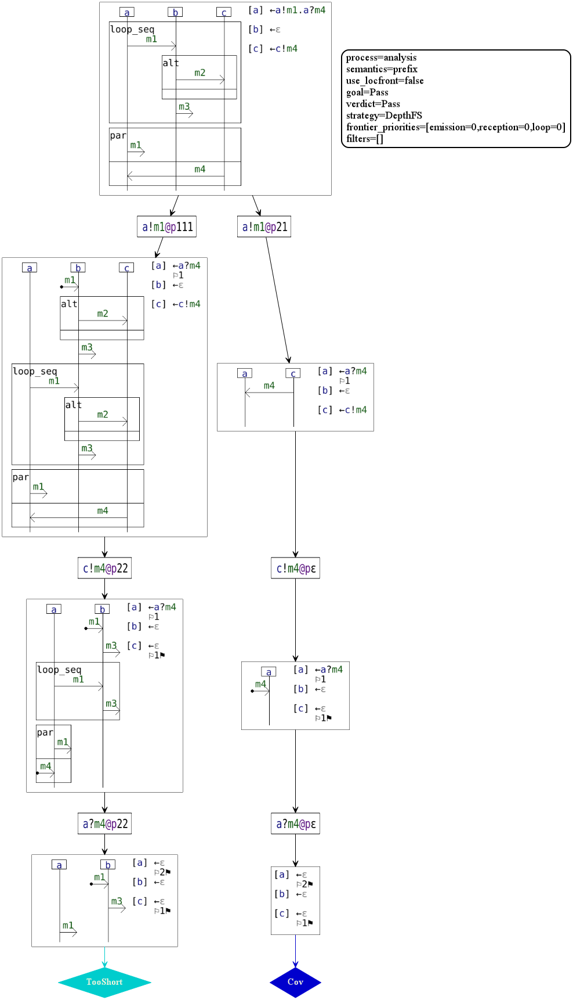

Let us note that we would have had the following if we had used the Breadth First Search strategy:

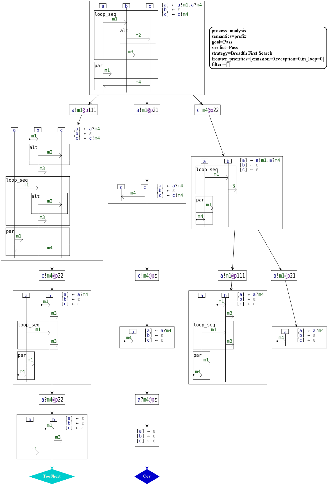

### Example 2

Below is another example, this time of the analysis of a global trace, and yielding the "WeakPass" verdict.
You can also reproduce it by using the files from the "examples" folder.

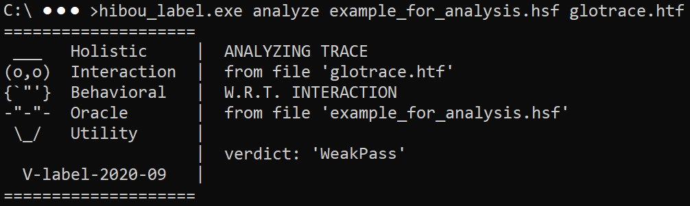

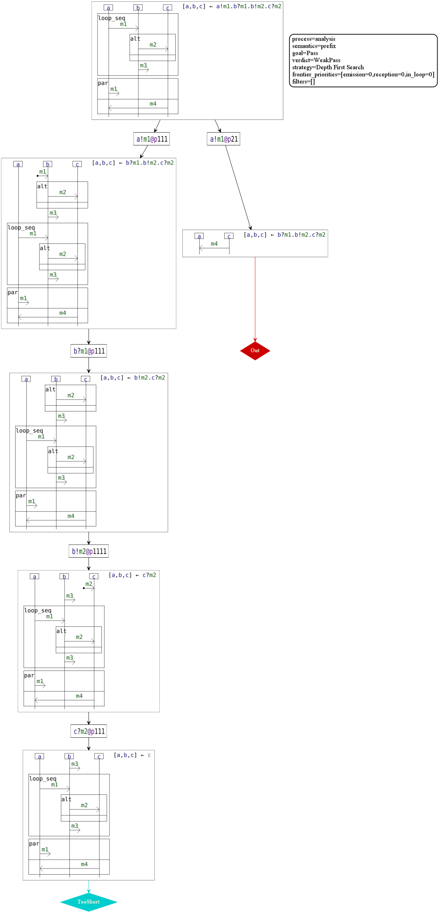

Let us note that, if we change the goal to "WeakPass" in the options, the branch on the right is not explored in the analysis because the analysis stops
once the goal verdict (or a verdict that is stronger) is reached.

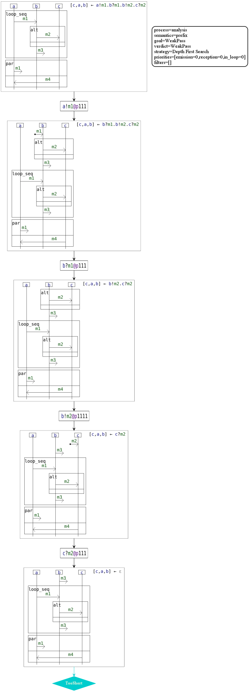

### Example showcasing frontier priorities

The child nodes of a given couple (interaction,multi-trace) correspond to the execution of a
frontier action of the interaction which match a head action of a trace component of the multi-trace.
The default order in which those matches are exploited is that of the lexicographic order of the positions of the 
matching frontier actions within the interaction.

For instance, if there are matches at positions 11, 12, 21 and 22 of the interaction, then the child nodes will be explored
in that order.

However, we can reorganize the order with which the matches (and therefore frontier) are explored. To do so, we use
the "frontier_priorities" option, for instance, as follows:

```
@analyze_option{
    semantics = accept;
    strategy = DepthFS;
    loggers = [graphic[svg]];
    goal = Pass;
    frontier_priorities = [reception=1]
}
```

Here we prioritize the evaluation of receptions found in the frontier. 
For instance if the matches are at positions 11 and 12 but the action at position 11 is an emission whereas the action
at position 12 is a reception, then, with those options, the match at position 12 will be exploited before the one
at position 11.

Below is illustrated the analysis of a multi-trace (in file "example_priority_2.htf") using a DFS strategy while prioritizing the evaluation of receptions
in the frontier. (model found in "example_priority_dfs.hsf")

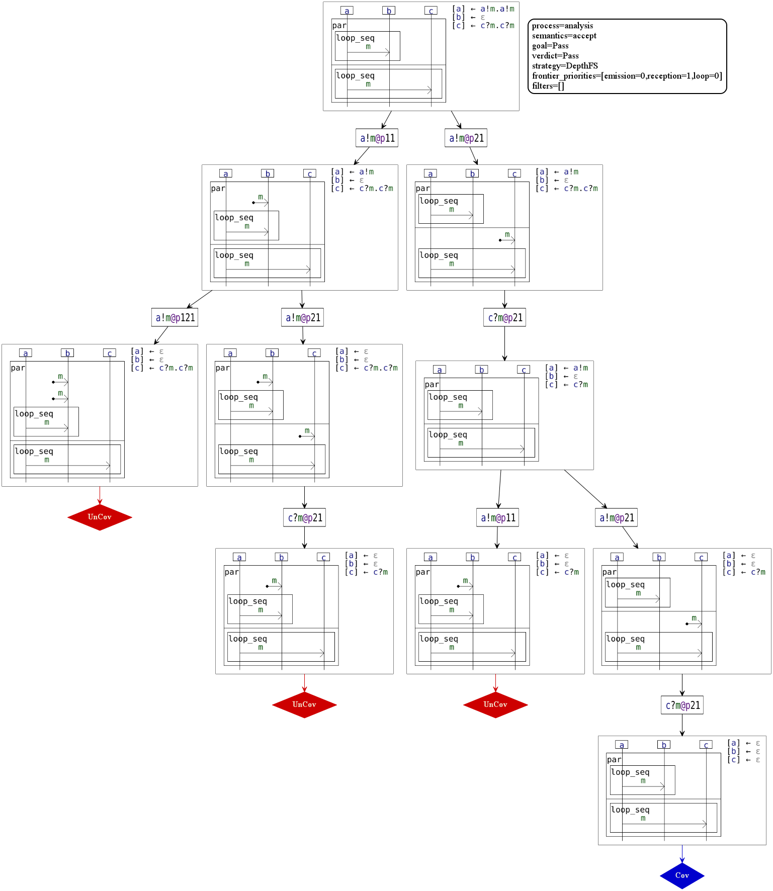

If we had not prioritized receptions, we would have had the following (still using DFS) (model found in "example_priority_dfs_no.hsf"):

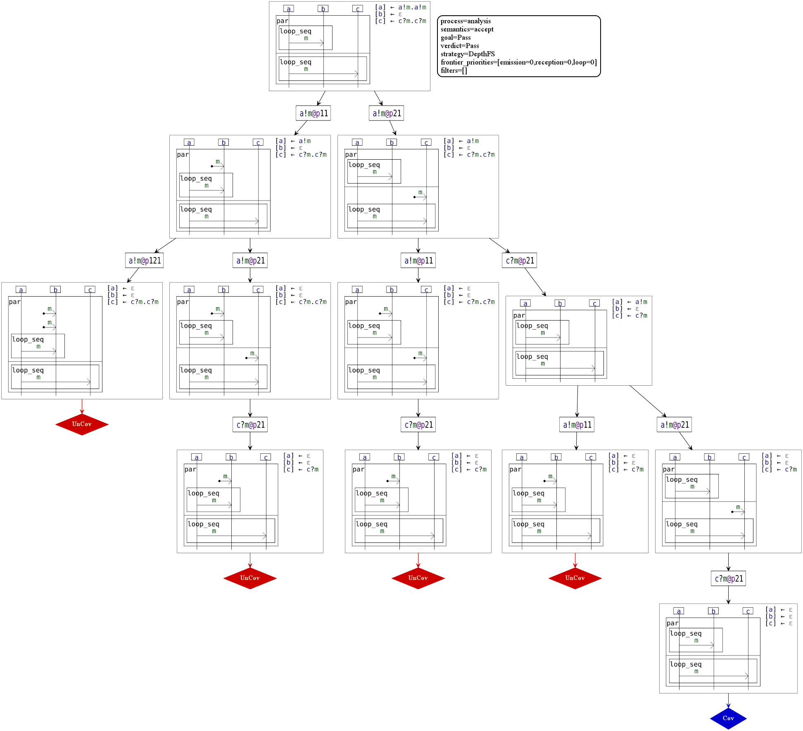

Prioritizing the evaluation of certain frontier actions may be advantageous (so as to find more quickly
a path that consumes the multi-trace) in certain cases. 
In this case, the model contains a repeating pattern (with a loop),
which beginning can, at each iteration be interpreted differently in the model.
Here, prioritizing receptions (in this case, it would be the same as de-prioritizing actions in loops with 
``frontier_priorities = [loop=-1]``), makes so that the analysis prefers to "finish" the evaluation of an instance of a loop
before instantiating another one.

The gain in "performances" can be assessed using the number of nodes necessary to obtain the "Pass" verdict (i.e. finding a "Cov" node).
Below is a table giving this number of nodes for respectively 1, 2, 3 and 4 repetition of the behavior (a!m,c?m)
and for cases where no action are prioritized (first row) and receptions are prioritized (second row).

|                            | 1 | 2  | 3  | 4  |
|----------------------------|---|----|----|----|
| DepthFS with no priorities | 4 | 12 | 39 |145 |
| DepthFS with reception=1   | 4 | 10 | 27 | 89 |

### Example showcasing Greedy Best First Search

In addition to the classical Breadth First Search and Depth First Search strategies, we experimented with a Greedy Best First Search strategy, 
which use can be specified and tweaked in the options with, for instance: 

```
@analyze_option{
    semantics = accept;
    strategy = GreedyBestFS[step=1];
    loggers = [graphic[svg]];
    goal = Pass
}
```

Our implementations of the BreadthFS and DepthFS strategies rely on a single simple queue so as to enqueue the newly computed nodes 
and to dequeue the nodes to be treated next.

By contrast, our implementation of GreedyBestFS rely on several queues, each corresponding to a certain priority level 
(this system implements efficiently a priority queue). The highest priority queue is dequeued first at each step of the algorithm.

Priority levels are computed according to the user-defined numbers set between the brackets, and they work in a similar manner as the frontier priorities.
For instance, if we set ``strategy = GreedyBestFS[step=0,emission=1,loop=-2]``, then the priority level of actions that are emissions 
and that exist within a loop will be "1+(-2)= -1". Those of emissions outside loops will be 1 and those of receptions outside loops will be 0.
You may notice that we have an additional kind of priority which is the ``step`` priority. 
By default, ``step=1`` (and the others are set to 0), which means that a next node of depth 
(distance to initial interaction) "d" will have a "d*1 = d" priority level.

Below is given the analysis of the same multi-trace as the previous example, on the same interaction, but this time using our custom
GreedyBestFS strategy.

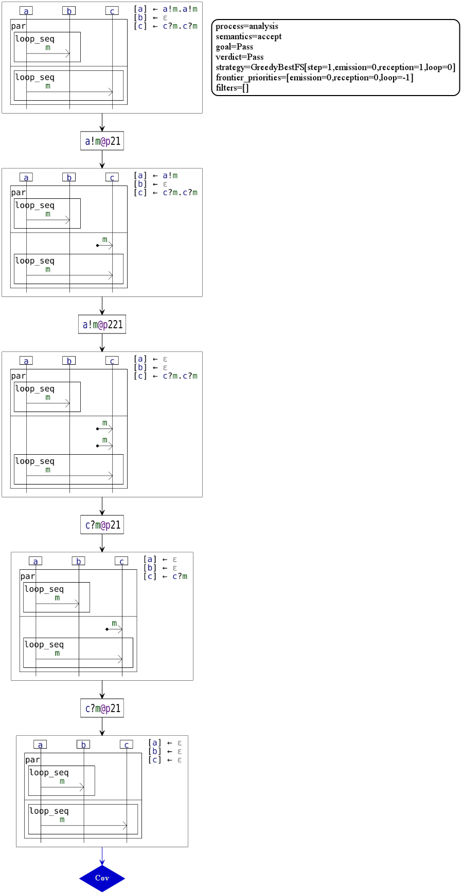

We can observe that in this precise case (interaction and multi-trace), the gain in "performances" is quite clear.
Below is a table giving the number of nodes explored for respectively 1, 2, 3 and 4 repetition of the behavior (a!m,c?m)
and for different uses of our proposed search heuristics.

|                                                   | 1 | 2  | 3  | 4  |
|---------------------------------------------------|---|----|----|----|
| BreadthFS with reception=1 as frontier priorities | 4 | 14 | 56 |244 |
| DepthFS with reception=1 as frontier priorities   | 4 | 10 | 27 | 89 |
| GreedyBestFS with step=1 as strategy              | 3 |  5 |  7 |  9 |

Although it may be impressive in this example, the GreedyBestFS (with or without the use of frontier priorities) is not, 
in the general case, more efficient than a DepthFS with frontier priorities.

In facts, with ``step=1`` (others to 0) and no frontier priorities, GreedyBestFS only "reverses" the frontier (compared with DepthFS with no frontier priorities)
i.e. it prioritizes the evaluation of actions that are farther
(in the lexicographic order of positions) in the interaction term.

This is why in this particular example, GreedyBestFS is more efficient than DepthFS ("sheer luck"). 
Indeed, the matching of "a!m" with the trigger action of "a -- m -> c" is done before that with "a -- m -> b"
so the algorithm doesn't explore those "dead-ends".

If we considered a multi-trace with a repetition of the (a!m,b?m) behavior, the situation (w.r.t. the respective performances of GreedyBestFS and DepthFS)
would be reversed.

With ``step=0`` (others to 0), GreedyBestFS is equivalent to BreadthFirstSearch.

To summarize, GreedyBestFS can be considered to be another implementation of a search strategy 
that includes the possible combinations of BreadthFS and DepthFS with frontier priorities.


## Analyze - "hide" mode

TODO: write README section

## Analyze - "simulate" mode

TODO: write README section

## Explore

The "explore" command of HIBOU can generate execution trees which illustrate the semantics of a given interaction model.

Below is given an example exploration that you can obtain by typing 
"hibou_label.exe explore example_for_exploration_1.hsf" 
with the files from "examples" folder.

Here we used the following options for the exploration:

```
@explore_option{
    strategy = DepthFS;
    loggers = [graphic[svg]];
    pre_filters = [ max_depth = 3, 
                    max_loop_depth = 1, 
                    max_node_number = 7 ]
}
```

As you can see, we can specify a number of filters that will limit the exploration 
of graphs in algorithmic treatments in 
different ways.
- "max_depth" limits the depth of the explored graph
- "max_loop_depth" limits the cumulative number of loop instances that can be unfolded in a given execution
- "max_node_number" limits the number of nodes in the explored graph

Although you can also specify those filters for the "analyze" command, it is not recommended, 
given that it might prevent the consumption of the multi-trace and produce a wrong verdict.

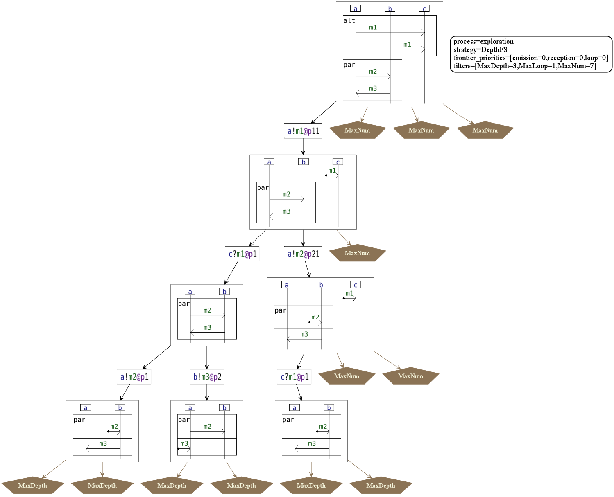

And here is a second example that you can obtain by typing 
"hibou_label.exe explore example_for_exploration_2.hsf" 
with the files from "examples" folder.

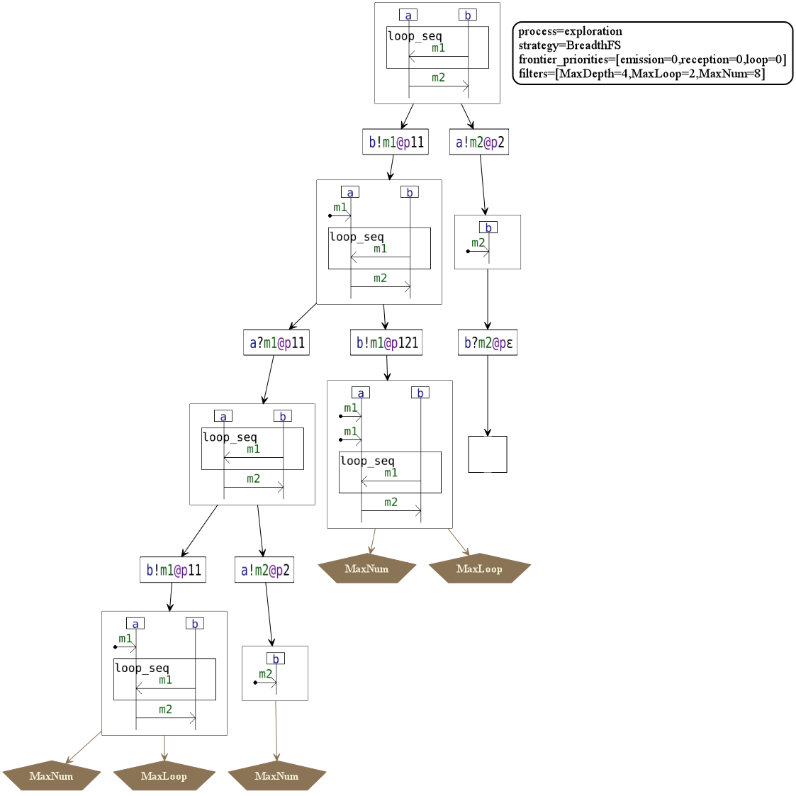

## Build

You can build the Rust project with cargo using "cargo build --release".

This will generate an executable in "./target/release".

Or you could download the provided binary for windows.

## Requirements / Dependencies

So as to generate the images of the graphs, you will need to have graphviz installed on your system. 
Graphviz is available at ( https://www.graphviz.org/download/ ).
The "dot" command provided by Graphviz must be in your "PATH" environment variable.

## Examples

All the examples in this README are provided in the "examples" directory as well as the commands used to generate the images above.
