# HIBOU ICTSS 2020

HIBOU (for Holistic Interaction Behavioral Oracle Utility) provides utilities for the analysis of traces and 
multi-traces collected from the execution of Distributed Systems against interaction models.

This piece of software has been developed as part of my PhD thesis in 2018-2020 at the 
[CentraleSupelec](https://www.centralesupelec.fr/)
engineering school
(part of Université Paris-Saclay) 
in collaboration with the 
[CEA](http://www.cea.fr/) (Commissariat à l'énergie atomique et aux énergies alternatives).

We described our approach in the following paper: 
"[Revisiting Semantics of Interactions for Trace Validity Analysis](https://link.springer.com/chapter/10.1007%2F978-3-030-45234-6_24)"
which was published in the 23rd International Conference on Fundamental Approaches to Software Engineering
i.e. the 2020 edition of the FASE conference, which is part of ETAPS (European joint conferences on Theory And Practice of Software).

This particular build has been prepared to accompany the publication of a paper in the 2020 edition of the ICTSS
conference (32ND IFIP INTERNATIONAL CONFERENCE ON TESTING SOFTWARE AND SYSTEMS). 
A long version of this paper is currently available [here](https://arxiv.org/abs/2009.01777) on Arxiv.

This README describes the software implementation.

If you are interested in the Coq proof, please click on this 
[link](https://erwanm974.github.io/coq_ictss_2020/) or visit the following
[repository](https://github.com/erwanM974/coq_ictss_2020).

## Entry language

Interaction models are specified with .hsf (Hibou Specification File) files.
The figure below illustrates:
- on the left the model of the interaction as a binary tree (mathematical model)
- in the middle the encoding using the entry langage of HIBOU (PEG grammar)
- on the right the resulting sequence diagram as drawn by HIBOU  

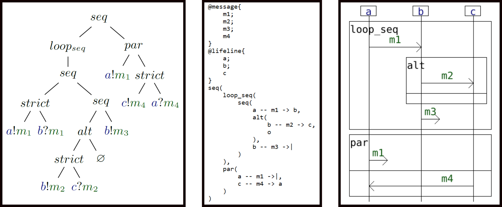

### Signature Declaration

The signature of the interaction model is declared in the "@message" and "@lifeline" sections of the .hsf file.
It suffices then to list the different message names and lifeline names that will be used in the model.

### Interaction Term

The interaction term is specified using a simple and intuitive inductive language.
- a reception "a?m" is specified using "m -> a"
- an emission to the environment "a!m" is specified using "a -- m ->|"
- message passings are encoded using "a -- m -> b"
- broadcasts are encoded using "a -- m -> (b,c,...)"
- loop operators (loop_strict, loop_seq, loop_par) are unary
- every other operator (strict,seq,alt,par) have been extended to allow n-ary expressions

### Process options

Additionally, one can specify in the header of a .hsf file 
a number of options that will then be used if this .hsf file is exploited 
in some algorithmic process
("explore" or "analyze" command).

In the example below, a Depth First Search exploration strategy 
is specified (by default it is Breadth First Search).

We can specify that we want algorithmic treatments of this .hsf file to be logged with the "loggers" attribute.
In this build only a "graphic" logger exists. 
It will create an image file (a .png file with the same name as the .hsf file) describing the treatment.

Finally, we can specify a number of filters that will limit the exploration 
of graphs in algoritmic treatments  in 
different ways.
- "max_depth" limits the depth of the explored graph
- "max_loop_depth" limits the cumulative number of loop instances that can be unfolded in a given execution
- "max_node_number" limits the number of nodes in the explored graph

## Command Line Interface

The functionnalities of HIBOU are accessed via a Command Line Interface (CLI).
For the version presented in this repository, you will have to launch the executable "hibou_ictss" (or "hibou_ictss.exe" on Windows OSs) from a terminal.

### Help

The HIBOU executable provides a small documentation about its interface. This can be accessed by tying "hibou_ictss help" or "hibou_ictss -h".
It explaines that there are 4 sub-commands in HIBOU:
- "draw" (to be used as "hibou_ictss draw <.hsf file>"), which draws as a sequence diagram a given interaction
- "explore" (to be used as "hibou_ictss explore <.hsf file>"), which computes (partially or totally if possible) the semantics of a given interaction
- "analyze" (to be used as "hibou_ictss analyze <.hsf file> <.htf file>"), which analyze a multi-trace w.r.t. an interaction
- "help", which is the present help

Each sub-command also has its dedicated documentation:
- "hibou_ictss draw -h" provides a small documentation for the drawing utility
- "hibou_ictss explore -h" provides a small documentation for the "explore" sub-command
- "hibou_ictss analyze -h" provides a small documentation for the "analyze" sub-command

In the following, we provide more details about those sub-commands.

### Draw

Diagrams, such as the one on the previous image can be drawn using the "hibou draw" command as exemplified below.

### Explore

The "explore" command of HIBOU can generate execution trees which illustrate the semantics of the a given interaction model.
The exploration of such execution trees can be defined up to certain limits (depth, number of nodes, loop 
instanciations) and up to certain search algorithms.

Below is given an example exploration that you can obtain by tying "hibou_ictss.exe explore example1.hsf". 
With the "example1.hsf" file provided in the "examples" folder.

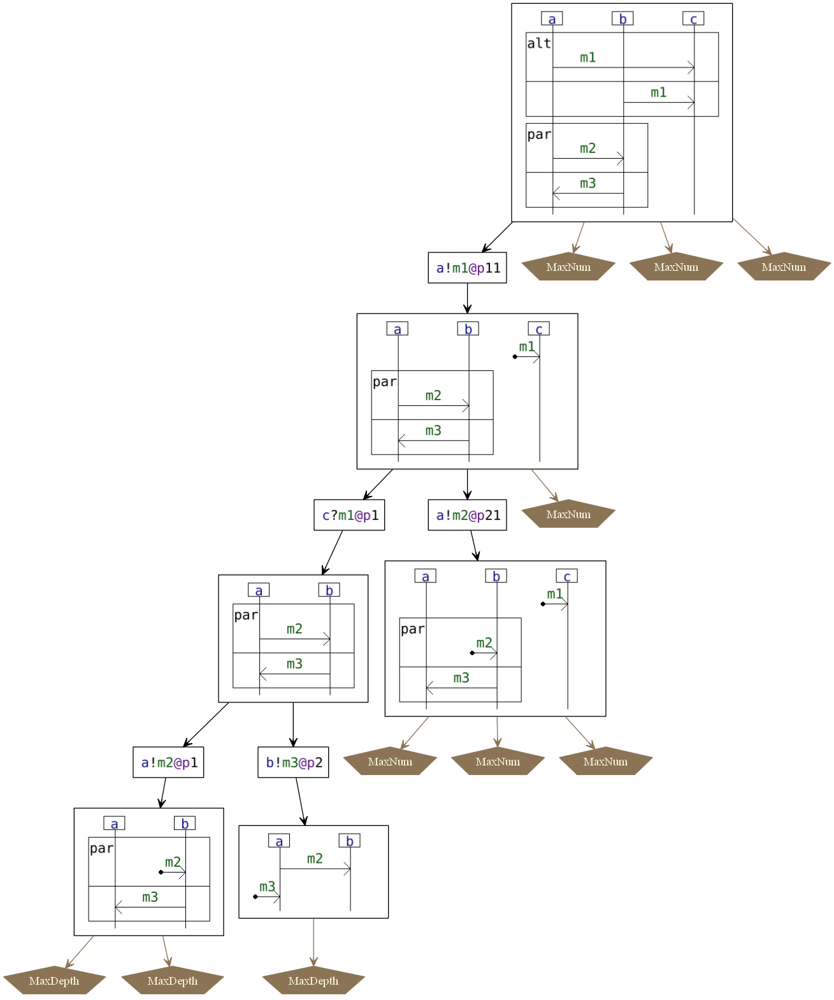

And a second example that you can obtain by tying "hibou_ictss.exe explore example2.hsf". 
With the "example2.hsf" file provided in the "examples" folder.

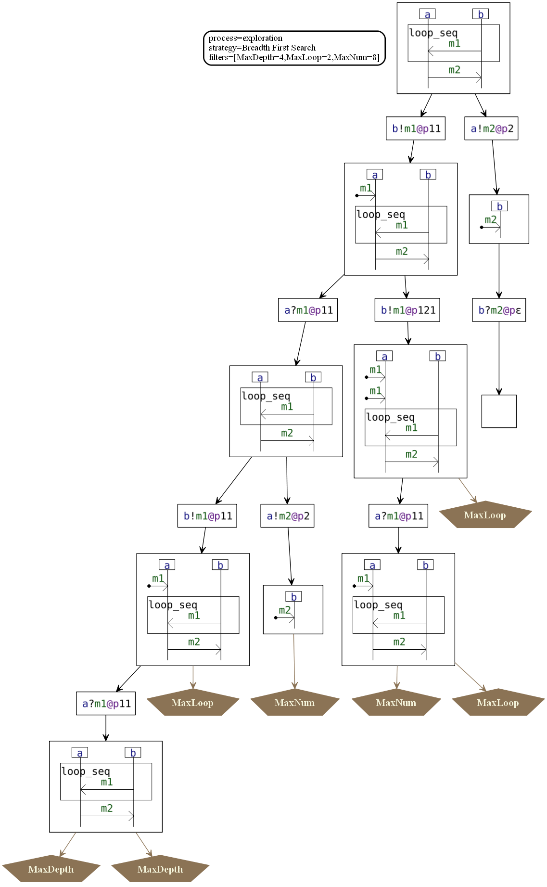

### Analyze

The "analyze" sub-command of HIBOU can analyse multi-traces w.r.t. interactions. 
For any multi-trace and any interaction, it returns a verdict about the conformity of the multi-trace w.r.t. the interaction. 
This verdict is either "Pass" or "Fail". 
We have proven in [this Coq proof](https://erwanm974.github.io/coq_ictss_2020/) that the verdict "Pass" is equivalent to the membership of the multi-trace to the semantics of the interaction.

#### Specifying multi-traces

As hinted at earlier, multi-traces are specified in .htf files, which stand for Hibou Trace File.

Multi-traces are sets of traces called its components. 
Each component is defined over a subset of lifelines called a co-localization that is disjoint to that of any other component.

In [the paper](https://arxiv.org/abs/2009.01777), we restricted co-localizations to singletons in order to simplify the presentation.
However, our approach still works when considering the more general case of co-localizations.

On the example below is given an example of .htf file which defines a multi-trace composed of 2 components:
- on the co-localization of the 2 lifelines "a" and "b", the local trace "b!m.a!m" has been logged
- on the localization of the "c" lifeline, the local trace "c?m.c?m" has been logged

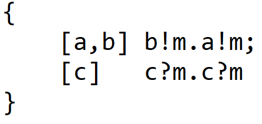

Let us note that we can analyze global traces simply by defining a multi-trace with a single component as is done below.
Here we used the "#all" keyword to state that this component is defined over all the lifelines defined in "@lifeline".

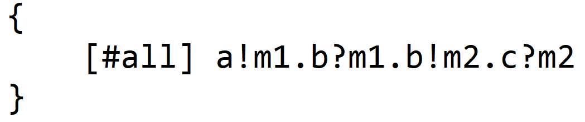

We could also have used the simpler syntax below to directly define our global trace:

We can also use the "#any" keyword to state that a given multi-trace component is defined over all the lifelines that appear in the subsequent trace definition.
For example below is defined a multi-trace that is the same than the one in our first example.
The first component is defined over lifelines "a" and "b", and the second over lifeline "c".

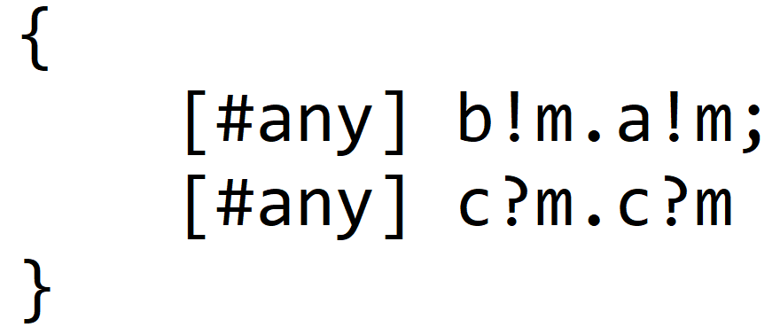

#### Analysing multi-traces  

A given analysis opens-up paths in the execution tree that are compliant with the consumption 
of the given multitrace. 
Each such path terminates either with 
- a "Cov" local verdict, when the multi-trace has been entirely consumed and the interaction can express the empty execution (statically verified on the interaction term)
- an "UnCov" local verdict in the other cases (i.e. either when the consumption of the multi-trace is impossible, or when the multi-trace has been emptied but the interaction cannot express the empty execution)

If there exists a path terminating in "Cov", a global verdict "Pass" is returned. 
The global verdict is "Fail" otherwise.

#### Example 1

Below is given an example analysis, that you can reproduce by tying 
"hibou_ictss.exe analyze example3.hsf multitrace_for_example3.htf"

With the "example3.hsf" and "multitrace_for_example3.htf" (or "multitrace_for_example3_bis.htf") files from the "examples" folder.

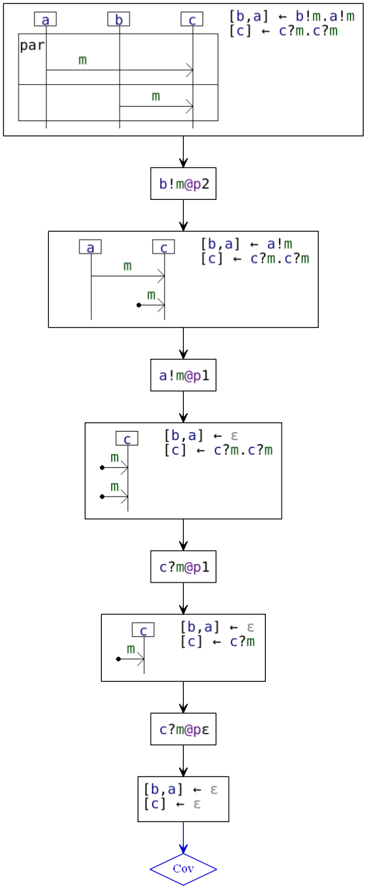

It yields the "Pass" global verdict 

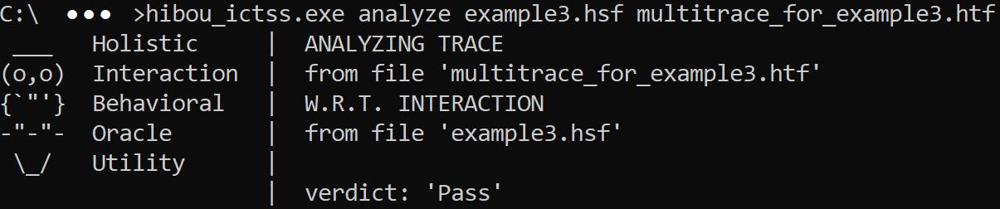

#### Example 2

Below is given an example analysis, that you can reproduce by tying 
"hibou_ictss.exe analyze example4.hsf multitrace_for_example4.htf"

With the "example4.hsf" and "multitrace_for_example4.htf" files from the "examples" folder.

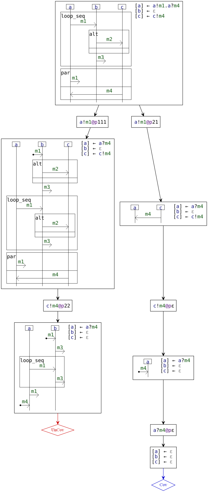

Likewise, it yields the "Pass" global verdict.

#### Example 3

Below is given an example analysis, that you can reproduce by tying 
"hibou_ictss.exe analyze example4.hsf global_trace_for_example4.htf"

With the "example4.hsf" and "global_trace_for_example4.htf" (or "global_trace_for_example4_bis.htf) files from the "examples" folder.

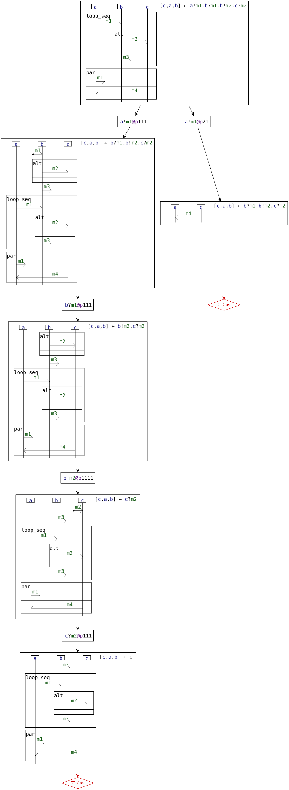

It yields the "Fail" global verdict 

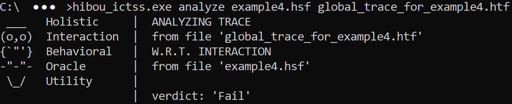

## Build

You can build the Rust project with cargo using "cargo build --release".

This will generate an executable in "./target/release".

Or you could download the provided binary for windows.

## Requirements / Dependencies

So as to generate the images of the graphs, you will need to have graphviz installed on your system. 
Graphviz is available at ( https://www.graphviz.org/download/ ).
The "dot" command provided by Graphviz must be in your "PATH" environment variable.

## Examples

All the examples in this README are provided in the "examples" directory as well as the commands used to generate the images above.
