# The execution and animation of interaction models

The main features of HIBOU revolve around the "execution" or "animation" of interaction models.
By execution we mean something which consists in executing an atomic action within an initial interaction model, thereby observing its occurrence.
The execution of such an action yields a new "follow-up" interaction model,
which specifies all the continuations of the behavior of the original interaction, which start by the occurence of the executed action.

This approach is detailed in
[this paper](https://link.springer.com/chapter/10.1007%2F978-3-030-45234-6_24) and [this one](https://dl.acm.org/doi/abs/10.1145/3412841.3442054).

In short, this consists in:
- identifying which atomic actions are immediately executable (frontier actions)
- when one such action is executed, computing, through the rewriting of the interaction term, the "follow-up" interaction

This is illustrated in the example below, where, for a given initial interaction, we represent all the atomic actions that can be
immediately executed within it, and, for each of those, the corresponding "follow-up" interactions.
This process can of course be repeated in a next step, making possible the computation of the expected behaviors (semantics)
of the initial interaction.

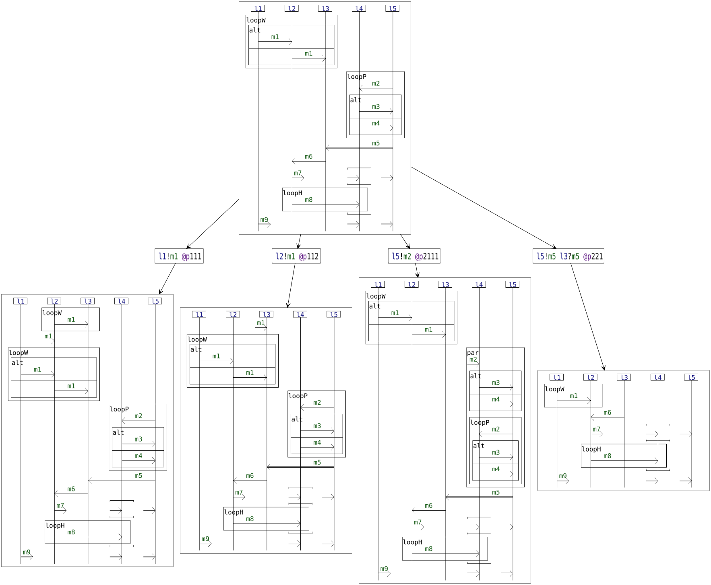

In the following, we will give some insights on the different elements of our language via the execution of interaction models.

## Basic building blocks

Execution of an atomic emission:

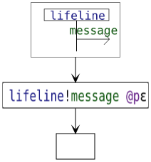

Execution of an atomic reception:

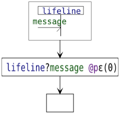

Execution of an asynchronous message passing:

Execution of a synchronous message passing:

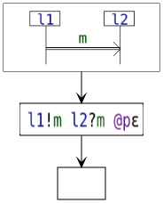

Execution of an asynchronous broadcast:

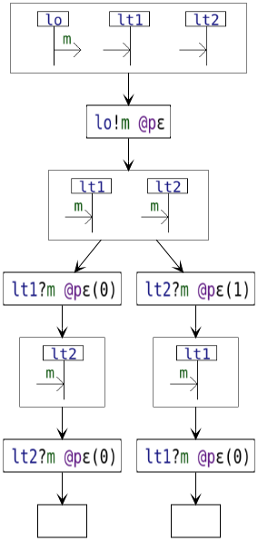

Execution of a synchronous broadcast:

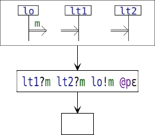

## Alt

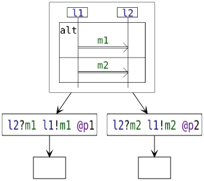

## Strict, Seq and Par

### Actions on the same lifeline(s)

With strict sequencing:

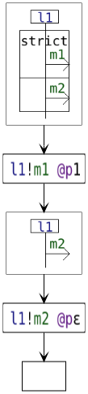

With weak sequencing:

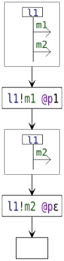

With interleaving:

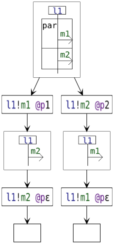

### Actions on different lifelines

With strict sequencing:

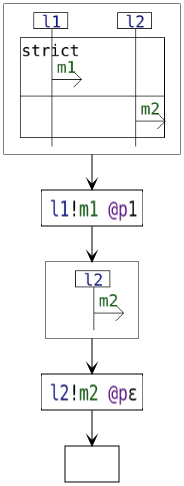

With weak sequencing:

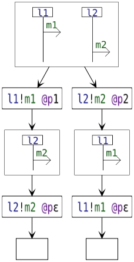

With interleaving:

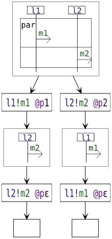

## Coreg

As explained previously, a coretion behaves as par on certain lifelines and as seq on the others.
Here, we can see that:
- l1 must emit m1 before it can emit m2 because the coregion behaves as seq on l1 
- and l2 can receive m1 and m2 in any order because the coregion behaves as par on l2 

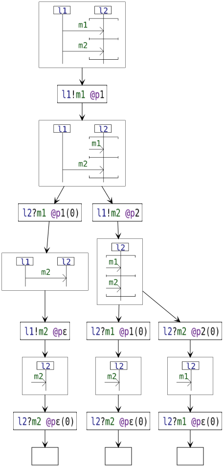

## Pruning

The interplay between alternatives and sequencing makes so that the execution of certain actions
implicitly imply making certain choices on alternatives. 
This must be taken into account when computing the corresponding follow-up interaction.

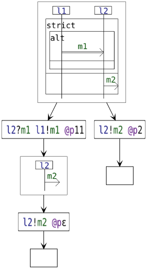

Another example with a coregion:

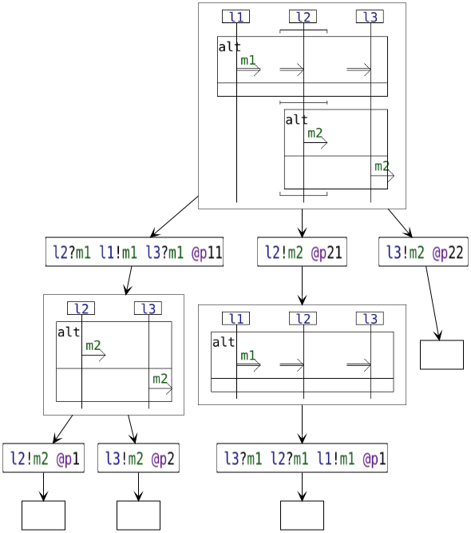

## Loops

Loops specify repetitions of behavior.
Please refer to "[A structural operational semantics for interactions with a look at loops](https://arxiv.org/abs/2105.00208)" for further details.

Below we demonstrate the difference between loopH and loopW on an example:

Here with loopH:

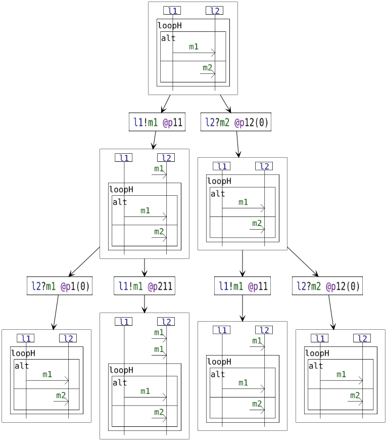

Here with loopW:

