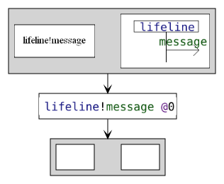
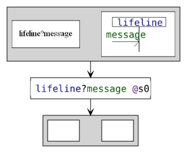
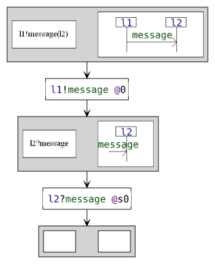
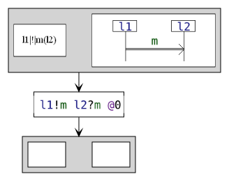
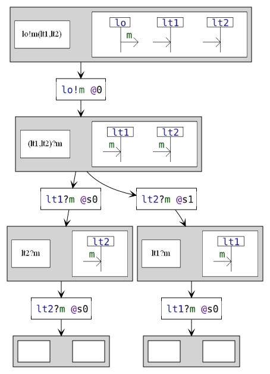
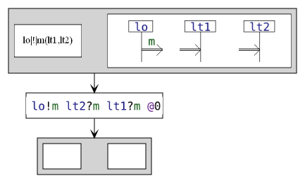

# The execution and animation of interaction models

The main features of HIBOU revolve around the "execution" or "animation" of interaction models.
By execution we mean executing an atomic action within an initial interaction model, thereby observing its occurrence.
The execution of such an action yields a new "follow-up" interaction model which specifies all the continuations of the behavior of the original interaction following the occurrence of the executed action.

This approach is detailed in
[this paper](https://link.springer.com/chapter/10.1007%2F978-3-030-45234-6_24) and [this one](https://dl.acm.org/doi/abs/10.1145/3412841.3442054).

In short, this consists in:
- identifying which atomic actions are immediately executable (frontier actions)
- when one such action is executed, computing, through the rewriting of the interaction term, the "follow-up" interaction

This is illustrated in the example below, where, for a given initial interaction, we represent all the atomic actions that can be
immediately executed within it, and, for each of those, the corresponding "follow-up" interactions.
This process can of course be repeated in a next step, making possible the computation of the expected behaviors (semantics)
of the initial interaction.

In the following, we will give some insights on the different elements of our language via the execution of interaction models.

## Basic building blocks

The previously introduced basic building blocks can be executed as is represented below.

Each node in grey represents the state of the interaction at a given moment, with, on the left, its syntaxic structure, and, on the right, its representation as a sequence diagram.

Each transition corresponds to the execution/expression of an atomic action.

|                  | Animation |
|------------------|-----------|
| atomic emission              |  |
| atomic reception             |  |
| asynchronous message passing |  |
| synchronous message passing  |  |
| asynchronous broadcast       |  |
| synchronous broadcast        |  |

## Alt

Alternatives propose non-deterministic choice between several exclusive alternatives.

## Strict, Seq and Par

Three basic scheduling operators enables us to specify successions of behaviors.

"strict" corresponds to a strict sequencing operator, specifying a strict succession of behaviors.

"seq" corresponds to a weak sequencing operator, specifying that events occurring on
the same sub-system (lifeline) must occur in a strict order
even though events occurring on different sub-systems (lifelines) may occur in any order.

"par" corresponds to an interleaving operator, allowing any order between events.

### Actions on the same lifeline(s)

| strict                                              | seq                                              | par                                              |
|-----------------------------------------------------|--------------------------------------------------|--------------------------------------------------|
|  |  |  |

### Actions on different lifelines

| strict                                              | seq                                              | par                                              |
|-----------------------------------------------------|--------------------------------------------------|--------------------------------------------------|
|  |  |  |

## Coreg

A coregion behaves as "par" on certain lifelines and as "seq" on the others.
In the example, we can see that:
- l1 must emit m1 before it can emit m2 because the coregion behaves as seq on l1 
- and l2 can receive m1 and m2 in any order because the coregion behaves as par on l2 

## Pruning

The interplay between alternatives and sequencing makes so that the execution of certain actions implicitly imply making certain choices on alternatives. 
This must be taken into account when computing the corresponding follow-up interaction.

This is done via a mechanism of pruning which is illustrated with the two examples below.

In the first one, we have an alternative in which we have either the passing of message "m1" or nothing, which is followed by the emission of "m2".
If the first thing that occur is the emission of "m2" then it is impossible to observe "m1" later on.
Hence, when executing the emission of "m2", this part of the diagram must be pruned out.

In the second example the pruning of the broadcast of "m1" only occur when it is "l3" which emits "m2" because there is a coregion on "l2" which would allow both orders on the event.

| example 1 | example 2 |
|-----------|-----------|
|  |  |

## Loops

Loops specify repetitions of behavior.
Please refer to "[Equivalence of Denotational and Operational Semantics for Interaction Languages](https://link.springer.com/chapter/10.1007/978-3-031-10363-6_8)" for further details.

Below we demonstrate the difference between loopH and loopW on an example:

Here with loopH:

Here with loopW:

